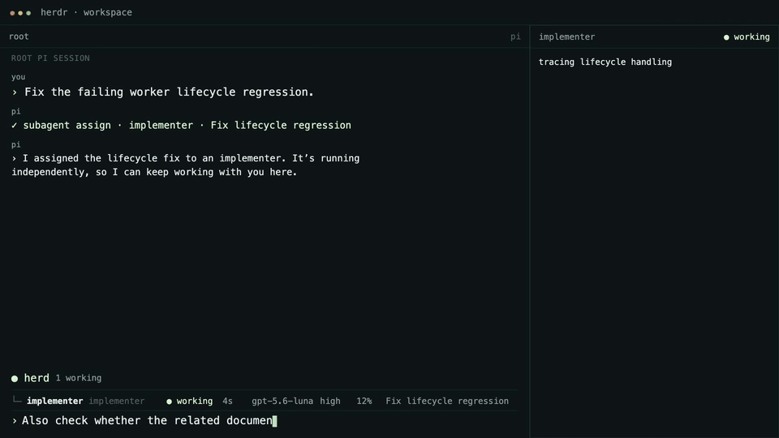

# Pi Herdsman 🐏


[](https://www.npmjs.com/package/pi-herdsman)
[](https://github.com/boadij/pi-herdsman/actions/workflows/validate.yml)
[](https://github.com/boadij/pi-herdsman/actions/workflows/validate.yml)
[](LICENSE)

**The orchestration layer between [Pi](https://github.com/earendil-works/pi) and [herdr](https://github.com/herdrdev/herdr).**

Pi Herdsman turns independent Pi sessions into a coordinated agent system, from
one background Agent to parallel branch-based project work. Pi owns each
coding-agent conversation; herdr owns processes, panes, workspaces, and worktree
placement; Herdsman connects them through delegation, ownership, supervision,
and project orchestration.

## Demo

_Concept animation, not a live recording._



## What Pi Herdsman gives you

- **Background Agents.** Delegate bounded work without blocking the Lead conversation.
- **Parallel and nested delegation.** Run independent work concurrently and let explicitly enabled Agents delegate their own bounded subtasks.
- **Project orchestration.** A Manager coordinates durable branch-based work across independent Leads and their Agent trees.
- **Direct supervision.** Chief, Manager, Lead, and Agent responsibilities stay explicit instead of collapsing into one global controller.
- **Owned usage visibility.** Inspect Pi-native token usage and cost for the current session plus transitively owned managed-Agent sessions.
- **Your workflow stays yours.** Bring your own Agent definitions, models, tools, skills, extensions, and development process.

## Quick start

On Linux or macOS, install the released Pi, herdr, and Pi Herdsman stack:

```sh
curl -fsSL https://raw.githubusercontent.com/boadij/pi-herdsman/main/install.sh | sh
```

If you already manage Pi and herdr yourself:

```sh
pi install npm:pi-herdsman
herdr integration install pi
```

Remove pi-herdr if installed. Herdsman now owns [pane metadata](docs/reference/pane-metadata.md); the official Herdr integration remains the sole state reporter.

Start herdr in your project, then start Pi inside its pane:

```sh
herdr
pi
```

Delegate naturally:

```text
Use scout to inspect the authentication flow.
```

The Agent runs asynchronously while the Lead conversation stays available.
Open the human Agent-management surface at any time with:

```text
/agents
```

It also exposes `Session stats` for the current Pi session and its owned Agent sessions.

See [Getting started](docs/getting-started.md) for prerequisites, configuration,
observability, and the complete first-use path.

## From one Agent to a project

A normal Pi session is a **Lead**. It owns the Agents it delegates:

```text
You ↔ Lead
      ├─ Agent
      │  └─ Agent
      └─ Agent
```

For independent project work, an eligible Lead can enter **Manager** mode.
Managers coordinate Leads instead of implementing through Agents themselves:

```text
You ↔ Manager
      ├─ Lead → Agents
      └─ Lead → Agents
```

A **Chief** is an optional runtime-wide supervisor above Managers. Without an
active Manager for a project, Chief can directly supervise its ordinary Leads.

The important boundaries are:

```text
supervision: Chief → Manager → Lead
ownership: Lead → Agent → Agent
```

Project work is durable by Git branch. It does not belong to the Manager session
that happened to start it, so work can be paused, resumed, completed, or
reconciled across Manager turnover.

See [Coordination](docs/concepts/coordination.md) for the mental model and
[Project orchestration](docs/guides/project-orchestration.md) for the Manager
workflow.

## Choose your next step

| Goal                                       | Start here                                                    |
| ------------------------------------------ | ------------------------------------------------------------- |
| Install and delegate your first task       | [Getting started](docs/getting-started.md)                    |
| Run independent branch-based project work  | [Project orchestration](docs/guides/project-orchestration.md) |
| Understand roles, ownership, and authority | [Coordination](docs/concepts/coordination.md)                 |
| Customize Agents                           | [Agent definitions](docs/guides/agent-definitions.md)         |
| Build against the model-facing tools       | [Coordination API](docs/coordination-api.md)                  |
| Deploy an SSH-ready environment            | [Container deployment](docs/guides/container-deployment.md)   |
| Contribute to Pi Herdsman                  | [Documentation index](docs/README.md#develop-pi-herdsman)     |

## Fork delta

This package is a fork of [boadij/pi-herdsman](https://github.com/boadij/pi-herdsman),
imported at `156b1c66` (v0.18.0). The fork's own changes:

- **Context retirement off by default** — `contextRetirement` defaults to `false`
  ([configuration](docs/reference/configuration.md)): managed agents are
  persistent sessions that compact through their own Pi context stack and stay
  continuable, instead of retiring at the compaction threshold.

- **Retained workers across assignments** — by default (`retainWorkers: true`), a
  delivered worker keeps its verified live process, pane, label, and mailbox and
  stays `idle` until `agent_continue` reuses it; a drifted or missing launch
  fingerprint closes it and continues the same session in a new process
  ([configuration](docs/reference/configuration.md),
  [handoffs](docs/guides/handoffs.md)). Fork branches: `finalizeDeliveredRoot`
  (`retainWorkersEnabled`), the `delivered` derivation in `managedAgentSnapshots`
  and `agentControlState` (`idle`), `listedAgentRecord`, `checkHerdRunFinished`
  (through `maybeFinishHerdRun`), and the delivered-assignment admission in
  `action`.

- **Advisory soft-deadline checkpoints** — `softTimeoutMs` arms one advisory
  window per accepted assignment; expiry publishes a digest that offers *keep
  waiting*, `agent_steer`, `agent_interrupt`, `agent_extend`, or `agent_close`,
  and it never aborts, steers, or closes anything
  ([configuration](docs/reference/configuration.md)). Fork branches:
  `softWindowsEnabled` (`softTimeoutMs`), `submit`, `scanAgentHealth`,
  `recoverControllerRuntimes`, and the `agent_extend` listing in
  `listedAgentRecord`.

Every function named above carries a fork-specific branch: the retention
branches are either gated by `retainWorkers` or derived from the retained
mailbox shape, and the soft-deadline branches read `softTimeoutMs`.

## Community

Questions, workflows, examples, and ideas are welcome in
[GitHub Discussions](https://github.com/boadij/pi-herdsman/discussions).

For reproducible bugs and concrete actionable work, use
[GitHub Issues](https://github.com/boadij/pi-herdsman/issues).

## License

[Apache License 2.0](LICENSE)
